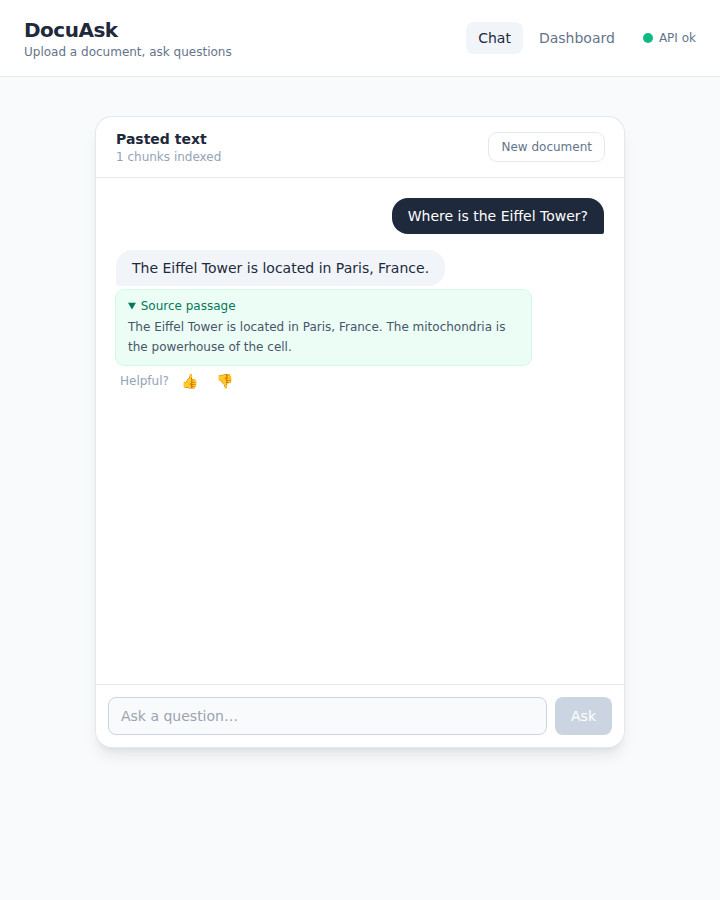
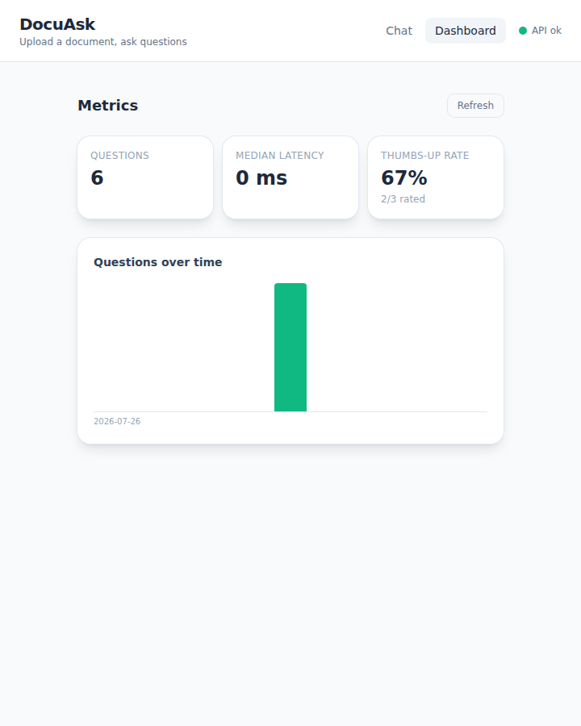

# DocuAsk

[](https://github.com/Sriyansh-28/docuask/actions/workflows/ci.yml)

**DocuAsk** is a full-stack document Q&A web app. Upload a PDF (or paste text),
ask questions in a chat box, and get answers with the **source passage** shown
underneath — then rate each answer 👍/👎 and watch the usage metrics update on a
live dashboard. It's a small, end-to-end product loop: a React front end, a
FastAPI back end, a lightweight retrieval layer, and a SQLite telemetry layer,
all runnable with one command and deployable as a single container.

🔗 **Live demo:** [huggingface.co/spaces/Sri-28/docuask](https://huggingface.co/spaces/Sri-28/docuask)
_(goes live once the Space is created — see [Deploy](#deploy-hugging-face-spaces))_

## Screenshots

| Chat — answer with source passage | Dashboard — live metrics |
| :---: | :---: |
|  |  |

## Features

- **Upload & parse** — drag-and-drop a PDF or paste text; the backend extracts
  (pypdf), chunks, and indexes it in memory. Encrypted / broken / non-PDF /
  empty / oversize inputs all fail with a clear, friendly message.
- **Chat with sources** — every answer shows the passage it was drawn from, so
  the retrieval is transparent.
- **Hybrid retrieval** — BM25 (`rank_bm25`) combined with a FAISS cosine search
  over TF-IDF vectors; deliberately lightweight, no heavyweight model.
- **Feedback & telemetry** — each question is logged to SQLite with its measured
  latency; 👍/👎 feedback and a `/dashboard` page show total questions, median
  latency, and thumbs-up rate live from the DB.

## Run it (one command)

```bash
docker compose up --build
```

Then open **http://localhost:5173**. The frontend calls the API through nginx,
so there's nothing else to configure.

## Run without Docker (dev)

**Backend**

```bash
cd backend
pip install -r requirements.txt
uvicorn app.main:app --reload   # http://localhost:8000
```

**Frontend**

```bash
cd frontend
npm install
npm run dev                     # http://localhost:5173
```

In dev the Vite server proxies `/api/*` to the backend, so no CORS setup is
needed.

## Tests

```bash
cd backend
pytest
```

The suite covers `/health`, upload success and every failure path, retrieval and
`/ask`, `/feedback`, `/stats`, and the combined deploy entrypoint. CI runs it on
every push.

## API

| Method | Path                | Purpose                                            |
| ------ | ------------------- | -------------------------------------------------- |
| GET    | `/health`           | Liveness probe.                                    |
| POST   | `/documents`        | Ingest a PDF file or raw text → `document_id`.     |
| GET    | `/documents/{id}`   | Document metadata.                                 |
| POST   | `/ask`              | `{document_id, question}` → answer + source passage. |
| POST   | `/feedback`         | Attach 👍/👎 (`up`/`down`) to an interaction.       |
| GET    | `/stats`            | Totals, median latency, thumbs-up rate, over-time. |

## Deploy (Hugging Face Spaces)

The root [`Dockerfile`](./Dockerfile) builds a **single image** that serves the
React frontend and the API from one origin (the API is mounted under `/api`), so
you get one live URL with no CORS to configure.

1. Create a new **Space** → **Docker** SDK (blank template).
2. Push this repository to the Space (or connect the GitHub repo). The Space
   reads the YAML front matter at the top of this README (`sdk: docker`,
   `app_port: 7860`) and builds the root `Dockerfile`.
3. Wait for the build; the app comes up at your Space URL. Paste that URL into
   the **Live demo** link above.

Telemetry uses `/tmp/docuask.db` by default (resets on restart). To persist it,
add HF **persistent storage** and set `DOCUASK_DB=/data/docuask.db` in the
Space's variables.

**Keep the demo in sync automatically.** The
[`sync-to-hf`](./.github/workflows/sync-to-hf.yml) workflow mirrors `main` to
your Space on every push. Configure it once under **Settings → Secrets and
variables → Actions**:

- Secret `HF_TOKEN` — a Hugging Face token with write scope. **This is the only
  required step** (username defaults to `Sri-28`, Space to `docuask`).
- Optionally override the `HF_USERNAME` / `HF_SPACE` variables.

Until `HF_TOKEN` is set the workflow no-ops, so it never fails the branch.

> Prefer split hosting (e.g. static frontend + separate API)? Set
> `VITE_API_URL` at frontend build time to the API origin and add that origin to
> the backend's `CORS_ORIGINS`. See the `.env.example` files.

## Project structure

```
docuask/
  backend/              # FastAPI app + tests
    app/
      main.py           # API: /health, /documents, /ask, /feedback, /stats
      parsing.py        # PDF/text extraction + chunking
      retrieval.py      # BM25 + FAISS (TF-IDF) hybrid index
      store.py          # in-memory document store
      db.py             # SQLite interaction telemetry
      server.py         # combined static + API entrypoint (deploy)
    tests/              # pytest suite
  frontend/             # Vite + React + Tailwind
    src/
      App.jsx           # layout + hash routing (Chat / Dashboard)
      DocumentUploader.jsx, Chat.jsx, Dashboard.jsx
  Dockerfile            # single-image build for Hugging Face Spaces
  docker-compose.yml    # local: frontend + backend together
  .github/workflows/    # CI: pytest + frontend build on every push
```

## Tech stack

- **Frontend:** React + Vite + Tailwind CSS
- **Backend:** FastAPI (Python)
- **Retrieval:** BM25 + FAISS over TF-IDF
- **Persistence:** SQLite (interaction telemetry)
- **Tests:** pytest
- **CI:** GitHub Actions (pytest + build on every push)
- **Deploy:** Docker (single-image Hugging Face Space); Docker Compose locally

## Roadmap

See [`PROJECT_SPEC.md`](./PROJECT_SPEC.md) for the full plan:

1. ✅ Skeleton end to end (health check wired browser → API)
2. ✅ Upload & parse flow (PDF/text → chunked, indexed)
3. ✅ Retrieval + chat loop (BM25 + FAISS, source passages)
4. ✅ Data-collection & feedback layer (SQLite, 👍/👎, `/stats`, dashboard)
5. ✅ Polish, tests, deploy (single-image Docker Space)

## License

[MIT](./LICENSE)
